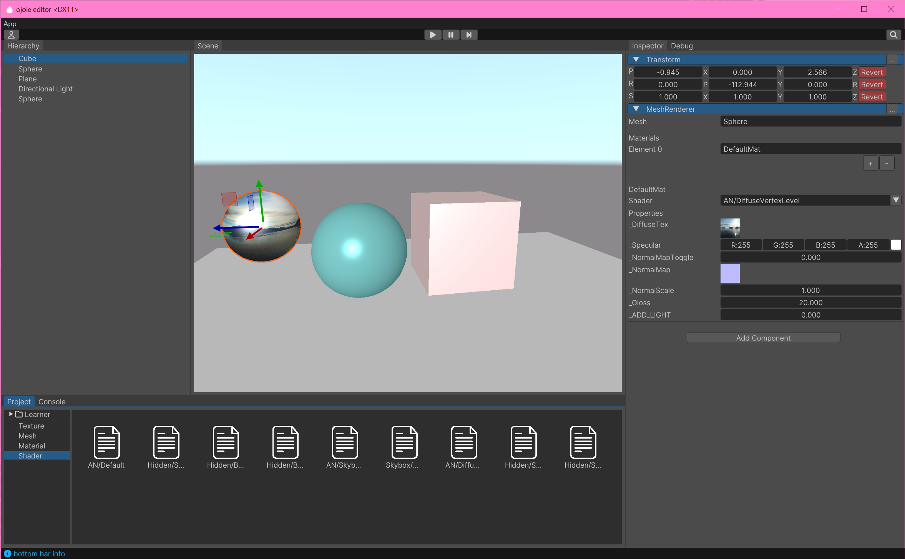
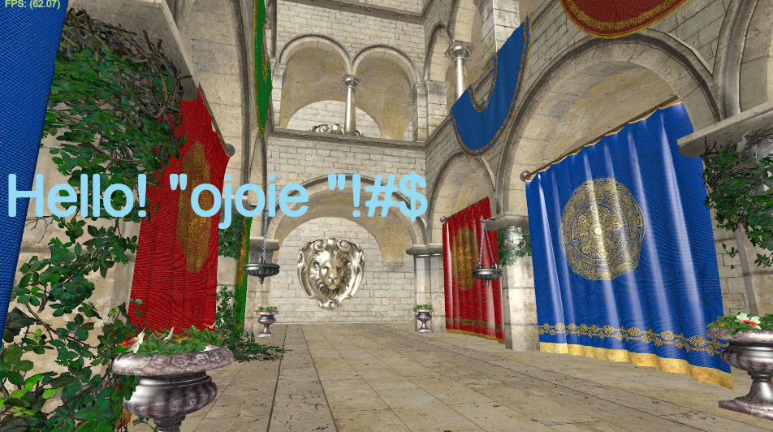
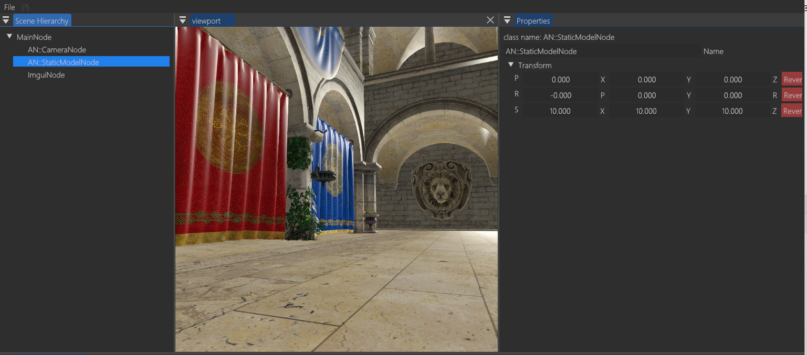

# ojoie : a mini game engine
***
Currently, this project is being active development and just basic set up the Vulkan rendering framework. Soon will change the architectural pattern of the engine to ECS.

### Goals
- Create a light-weight game engine with modern architecture design.

## Build
### Supported Platforms
- Windows (more platforms will support in the future)

1. install cmake build system
2. type following commands in a terminal
   1. mkdir build
   2. cd build
   3. cmake ..
   4. cmake -- build .
3. the engine shared library will in the bin folder with the test application named "3d-test"

### Snapshots

