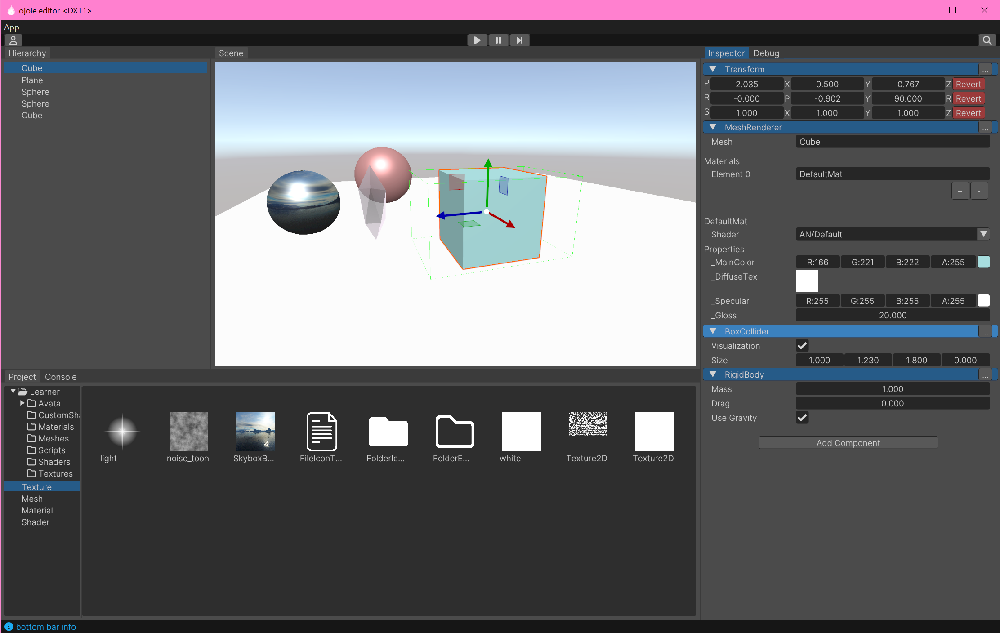

#### Ojoie: A simple game engine demo

***
Build Guide:
1. Download third-party dependencies and decompress and replace them in the project root directory
Link: https://pan.baidu.com/s/1h0c49vv_ubauU0UAk9oG6A?pwd=8wsp Extraction code: 8wsp
2. Build based on cmake
3. Run the two targets ImportEditorResources and RecompileBuiltiShaders
4. Copy third-party dynamic libraries to the runtime directory

This project is based on CMake to build a system, and the following functions have been implemented:
1. runtime base class Object: This base class stores its constructor, destructor, class size, and other information through the Class class, allowing for the creation of instances of classes through class names or IDs, and dynamically obtaining Class information through the isa pointer at runtime. In addition, it also supports obtaining all instances of a certain class and its subclasses, supports message passing (only one parameter is supported), and can serialize and deserialize the class.
2. Win32 GUI: Encapsulates functions such as windows and message loops. Implemented mouse and keyboard input through InputManager, using Win32 Raw Input. At the same time, audio output was achieved using XAudio2 (currently incomplete, plan to switch to FMod in the later stage).
3. Encapsulation of DirectX 11 basic rendering pipeline: Implemented functions such as Material, Shader, RenderTarget, Texture2D, TextureCube, Mesh, MeshRenderer, Camera, CommandBuffer, etc.
4. Analysis of ShaderLab shader description language: Using recursive descent analysis to parse ShaderLab shader description language, compile and generate dxbc data, and reflect information such as input and output of shaders, variable offsets in cbuffers, and texture.
5. Encapsulation of FBX sdk: loaded as a DLL plugin, realizing the import of Mesh.
6. Implemented basic EC mode components such as Actor, Component, and Transform.
  After the program crashes, perform minidump and display the crash information.
7. Skinned Mesh
8. Actor and Component Serialization

#### Snapshots

