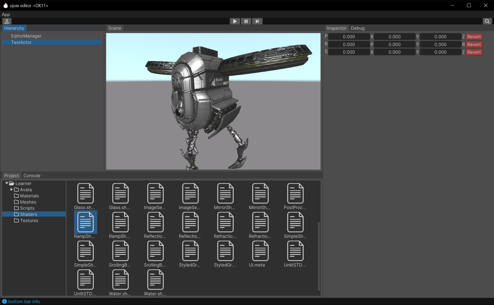

#### ojoie : 一个简易游戏引擎demo
***
本项目基于CMake构建系统，目前已实现功能：

1. 运行时基类Object：该基类通过Class类储存其构造函数、析构函数、类大小等信息，允许通过类名或类ID创建类的实例，并在运行时通过isa指针动态获取Class类信息。此外，它还支持获取某个类及其子类的所有实例，支持消息传递（只支持一个参数），并可以对类进行序列化和反序列化。
1. Win32 GUI：封装了窗口、消息循环等功能。通过InputManager实现了鼠标、键盘的输入，使用Win32 Raw Input。同时，使用XAudio2实现了音频输出（目前不完善，计划后期改用FMod）。
1. DirectX 11基本渲染管线的封装：实现了Material、Shader、RenderTarget、Texture2D、TextureCube、Mesh、MeshRenderer、Camera、CommandBuffer等功能。
1. 对类ShaderLab着色器描述语言的解析：采用递归下降分析法对ShaderLab着色器描述语言进行解析，编译生成dxbc数据，并反射出shader的输入、输出、cbuffer中变量偏移、texture等信息。
1. 封装FBX sdk：作为dll插件加载，实现了对Mesh的导入。
1. 实现了基础的EC模式的Actor、Component，以及Transform等Component。
1. 程序崩溃后，进行minidump，并展示崩溃的信息。

#### Snapshots

